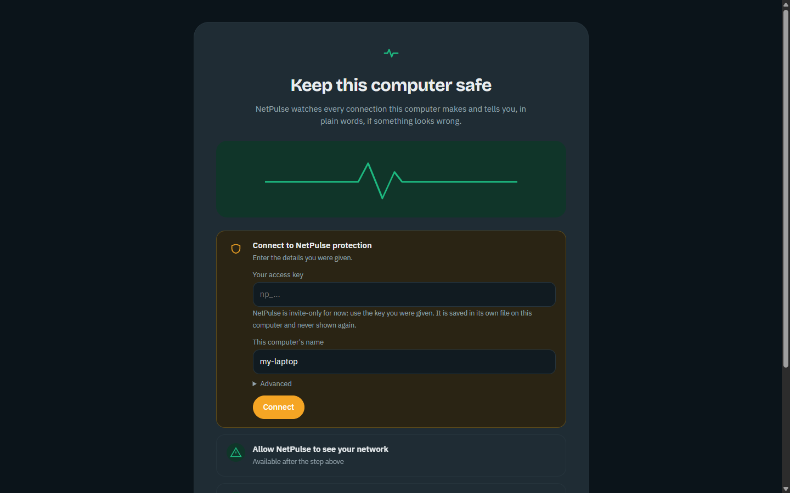

# First run: start here

From nothing to protected in about ten minutes. Follow the steps in order; each one says what you should see.

--8<-- "request-access.md"

The key is issued by hand and can take a little while, so request it first; you can install everything meanwhile.

## The nine steps

{ loading=lazy }

1. **Download NetPulse.**
   On the [Download page](../download.md) your system is preselected. One package contains the desktop app and the command line.
2. **Install NetPulse.**
   - **Windows:** run the installer. It installs for your user only and needs no administrator rights. Install [Npcap](https://npcap.com/#download) once, too.
   - **macOS / Linux:** see the [macOS](install/macos.md) and [Linux](install/linux.md) guides.
3. **Open NetPulse.**
   You see *Keep this computer safe* with three steps: connect, network access, start.
4. **Confirm the computer's name.**
   It is pre-filled from your computer name. It is a label that helps you recognise this computer; you can keep it.
5. **No access key yet? Request AI access.**
   Use the [request form]({{ access_form_url }}){ target="_blank" rel="noopener" }.
6. **Receive your key by e-mail.**
   It starts with `np_`. Keep it private.
7. **Paste the key and press Connect.**
   The NetPulse AI service address is already filled in under *Advanced*; leave it. The key is saved in its own file and never shown again.
8. **Check "NetPulse can see your network".**
   On Windows, if Npcap is missing, NetPulse shows the official link with *Copy link*, and a **Check again** button once it is installed. It never installs Npcap for you.
9. **Press Start protection.**
   Within a minute, Home lists your apps and says *Your computer looks safe*; the footer says *Connected to NetPulse AI · model 2*.

## If you get stuck

| You see | Do this |
|---|---|
| *Access key not accepted* | The key was not pasted completely (it starts with `np_`), or it was revoked. [Request a new one]({{ access_form_url }}){ target="_blank" rel="noopener" } if it keeps failing. |
| *NetPulse AI not reachable* | Check your internet connection. Connections wait in a queue; nothing is lost or guessed. |
| The network step stays red (Windows) | Install Npcap with the default options, then press **Check again**. |
| Nothing appears after Start protection | Connections are checked when they end; browse a little and wait a minute. |

More: [Troubleshooting](troubleshooting.md) · [Desktop app](desktop.md) · [Updating later](updating.md)
